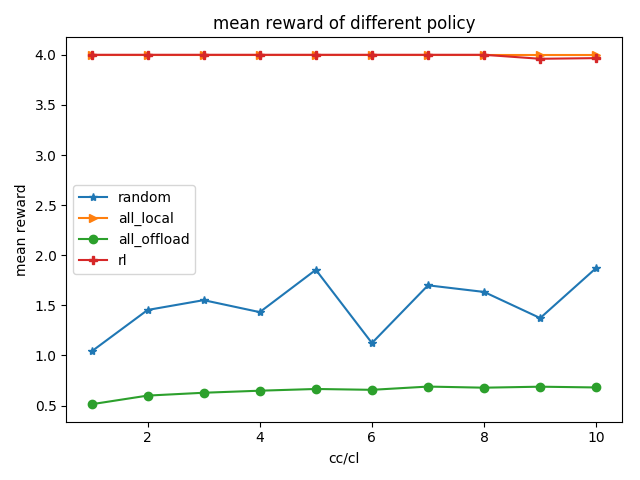

## cl/cl 比例对在各种不同算法下的效果

### 第一次

```yaml
cc_cl_checkpoint_path: []
cc_cl_scale: [1, 2, 3, 4, 5, 6, 7, 8, 9, 10]
env: ec
env_args:
  bandwidth: [2, 1, 0.1]
  max_steps: 20
  n_actions: 2
  n_agents: 4
  observation_size: 2
  prob: [0.1, 0.55, 1]
  seed: null
  sum_d: 10
  task_proportion: [0.25, 0.25, 0.25, 0.25]
gen_data_cc_cl: false
gen_data_light_load: false
gen_data_mid_load: false
gen_data_weight_load: false
gen_t_max: 6000
light_load_checkpoint_path: []
light_load_prob: [0, 0.1, 0.2, 0.3, 0.4, 0.5, 0.6, 0.7, 0.8, 0.9, 1]
mid_load_checkpoint_path: []
mid_load_prob: [0, 0.1, 0.2, 0.3, 0.4, 0.5, 0.6, 0.7, 0.8, 0.9, 1]
t_max: 80000
train_cc_cl_scale: false
train_light_load_prob: false
train_mid_load_prob: false
train_weight_load_prob: false
weight_load_checkpoint_path: []
weight_load_prob: [0, 0.1, 0.2, 0.3, 0.4, 0.5, 0.6, 0.7, 0.8, 0.9, 1]
plot_cc_cl_scale: false
plot_light_load: false
plot_mid_load: false
plot_weight_load: false
```

结果：



```yaml
cc_cl_checkpoint_path: [qmix__2020-03-14_10-06-01, qmix__2020-03-14_10-10-32, qmix__2020-03-14_10-15-23,
  qmix__2020-03-14_10-21-51, qmix__2020-03-14_10-26-35, qmix__2020-03-14_10-31-36,
  qmix__2020-03-14_10-36-41, qmix__2020-03-14_10-41-34, qmix__2020-03-14_10-46-16,
  qmix__2020-03-14_10-50-37]
cc_cl_scale: [1, 2, 3, 4, 5, 6, 7, 8, 9, 10]
env: ec
env_args:
  bandwidth: [2, 1, 0.1]
  max_steps: 20
  n_actions: 2
  n_agents: 4
  observation_size: 2
  prob: [0.9, 0.95, 1]
  seed: null
  sum_d: 10
  task_proportion: [0.25, 0.25, 0.25, 0.25]
gen_data_cc_cl: false
gen_data_light_load: false
gen_data_mid_load: false
gen_data_weight_load: false
gen_t_max: 6000
light_load_checkpoint_path: []
light_load_prob: [0, 0.1, 0.2, 0.3, 0.4, 0.5, 0.6, 0.7, 0.8, 0.9, 1]
mid_load_checkpoint_path: []
mid_load_prob: [0, 0.1, 0.2, 0.3, 0.4, 0.5, 0.6, 0.7, 0.8, 0.9, 1]
t_max: 80000
train_cc_cl_scale: false
train_light_load_prob: false
train_mid_load_prob: false
train_weight_load_prob: false
weight_load_checkpoint_path: []
weight_load_prob: [0, 0.1, 0.2, 0.3, 0.4, 0.5, 0.6, 0.7, 0.8, 0.9, 1]
plot_cc_cl_scale: true
plot_light_load: false
plot_mid_load: false
plot_weight_load: false
```

结果：


